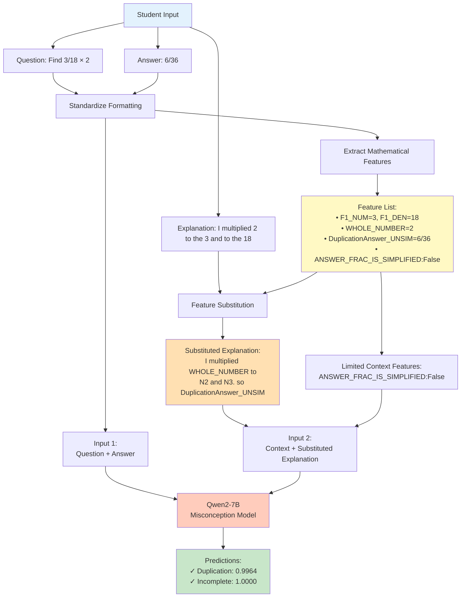

# Predicting Math Misconceptions

[](https://www.python.org/downloads/)
[](https://opensource.org/licenses/MIT)
[](https://huggingface.co/spaces/jprich1984/Math_Misconception_App)

An AI system that analyzes student math explanations to identify specific misconceptions and predict answer correctness, built using dual fine-tuned Qwen2-7B models with novel feature engineering and value-generalization techniques.

## 🎯 Live Demo

Try it yourself: [**Math Misconception Detection App**](https://huggingface.co/spaces/jprich1984/Math_Misconception_App)

## 📊 Project Overview

This system addresses a critical challenge in math education: **automatically identifying why students get problems wrong**. Instead of just marking answers as incorrect, our models pinpoint specific misconceptions (e.g., "Duplication", "Inversion", "Wrong_Operation") by analyzing student reasoning.

### Key Innovation: Value-Agnostic Learning

Traditional models memorize specific numbers. Our approach uses **feature substitution** to learn conceptual patterns that generalize across all numerical values.

## 🔄 How It Works


## 💡 Example Results

### Sample 1: Correct Reasoning
**Question:** Find \(\frac{3}{18} \times 2\). simplify if necessary.

**Student Answer:** \(\frac{1}{3}\)

**Original Explanation:** "I did 2 times 3/18. so its 6/18 which simplifies to 1/3"

**Processed Input:**
```
<MATH_CONTEXT> F1_NUM_LT_DEN:TRUE | ANSWER_HAS_FRACTION:TRUE | ANSWER_FRAC_IS_SIMPLIFIED:True </MATH_CONTEXT>
I did WHOLE_NUMBER times F1_BOTH_MULT_N2. so its F1xN1_CORRECT_UNSIM which simplifies to F1xN1_SIM
```

**Predictions:**
| Rank | Misconception | Probability |
|------|--------------|-------------|
| 1 | No Misconception | 0.9988 |
| 2 | Duplication | 0.0000 |
| 3 | Inversion | 0.0000 |

✅ **Correctly identified valid reasoning**

---

### Sample 2: Duplication Error (Incomplete)
**Question:** Find \(\frac{3}{18} \times 2\). simplify if necessary.

**Student Answer:** \(\frac{6}{36}\)

**Original Explanation:** "I multiplied the 2 to the 3 and to the 18. so 6/36"

**Processed Input:**
```
<MATH_CONTEXT> F1_NUM_LT_DEN:TRUE | ANSWER_HAS_FRACTION:TRUE | ANSWER_FRAC_IS_SIMPLIFIED:False </MATH_CONTEXT>
I multiplied the WHOLE_NUMBER to the N2 and to the N3. so DuplicationAnswer_UNSIM
```

**Predictions:**
| Rank | Misconception | Probability |
|------|--------------|-------------|
| 1 | Incomplete | 1.0000 |
| 2 | Duplication | 0.9964 |
| 3 | Mult | 0.0002 |

✅ **Correctly identified both Duplication (multiplying whole number by numerator AND denominator) and Incomplete (answer not simplified)**

---

### Sample 3: Inversion Error
**Question:** Find \(\frac{3}{18} \times 2\). simplify if necessary.

**Student Answer:** \(\frac{1}{18}\)

**Original Explanation:** "I inverted the 2 to make it 3/18 times 1/2. 3x1=3 and 18x2=36, so its 2/36 which simplifies to 1/18"

**Processed Input:**
```
<MATH_CONTEXT> F1_NUM_LT_DEN:TRUE | ANSWER_HAS_FRACTION:TRUE | ANSWER_FRAC_IS_SIMPLIFIED:True </MATH_CONTEXT>
I inverted the WHOLE_NUMBER to make it F1_BOTH_MULT_N2 times F1xN2_SIM. N2 x F1_NUM=N2 and N3 x WHOLE_NUMBER=F1_DEN_TIMES_WHOLE, 
so its WHOLE_NUMBER/F1_DEN_TIMES_WHOLE which simplifies to F1divN2_UNSIM
```

**Predictions:**
| Rank | Misconception | Probability |
|------|--------------|-------------|
| 1 | Inversion | 0.9980 |
| 2 | Duplication | 0.0001 |
| 3 | No Misconception | 0.0000 |

✅ **Correctly identified student inverted the whole number (treating multiplication as division)**

---

## 🏗️ Technical Architecture

### Dual-Model System

| Model | Task | Architecture | F1 Score |
|-------|------|--------------|----------|
| **Correctness Model** | Predict if answer is correct/incorrect | Qwen2-7B + LoRA (r=64) | 0.9822 |
| **Misconception Model** | Multi-label classification (37 classes) | Qwen2-7B + LoRA (r=64) | 0.9835 |

Both models:
- 4-bit quantization (QLoRA)
- Fine-tuned on augmented dataset with feature substitution
- Trained on same Qwen2-7B base model with different task heads

### Input Format

**Correctness Model:**
- Input 1: `Question + MC_Answer`
- Input 2: `Full_Math_Context + Substituted_Explanation`

**Misconception Model:**
- Input 1: `Question + MC_Answer`  
- Input 2: `Reduced_Math_Context + Substituted_Explanation`

### Feature Substitution System

The core innovation that enables generalization:

**Before Substitution:**
```
"I did 2 times 3 over 18. so its 6/18 which simplifies to 1/3"
```

**After Substitution:**
```
"I did WHOLE_NUMBER times F1_BOTH_MULT_N2. so its F1xN1_CORRECT_UNSIM which simplifies to F1xN1_SIM"
```

**Generated Features (Examples):**
- `F1_NUM=3`, `F1_DEN=18` - Original fraction components
- `F1xN1_CORRECT_UNSIM=6/18` - Correct answer before simplification
- `F1xN1_SIM=1/3` - Correct answer simplified
- `DuplicationAnswer_UNSIM=6/36` - What answer would be if student multiplied both parts
- `InversionAnswer_UNSIM=3/36` - What answer would be if student inverted the whole number

This allows the model to learn: *"When student mentions DuplicationAnswer_UNSIM, they likely made the Duplication error"* — **regardless of the specific numbers involved**.

## 📁 Project Structure
```
Predicting_Math_Misconceptions/
├── data/                          # Training and validation datasets
├── notebooks/                     # Jupyter notebooks for experimentation
│   ├── training.ipynb
│   ├── evaluation.ipynb
│   └── data_augmentation.ipynb
├── utils/                         # Utility functions
│   ├── preprocessing_functions.py
│   ├── augment_functions.py      # Feature extraction & substitution
│   └── evaluation_functions.py
├── models/                        # Model architecture definitions
│   └── multitask_qwen.py
├── checkpoints/                   # Saved model weights
│   ├── stage2_explanation_model_dec5_restructure.pt  # Correctness model
│   └── stage2_explanation_model_dec5_MISC_ONLY_SUB_Other.pt  # Misconception model
├── app.py                         # Gradio web application
├── requirements.txt               # Python dependencies
└── README.md
```

## 🚀 Getting Started

### Installation
```bash
git clone https://github.com/yourusername/Predicting_Math_Misconceptions.git
cd Predicting_Math_Misconceptions
pip install -r requirements.txt
```

### Running the App Locally
```bash
python app.py
```

The Gradio interface will launch at `http://localhost:7860`

### Using the Models
```python
from models.multitask_qwen import MultiTaskQwen
from utils import preprocessing_functions as pf
from utils import augment_functions

# Load model
model = MultiTaskQwen(
    model_name='Qwen/Qwen2-7B-Instruct',
    num_categories=6,
    num_misconceptions=37
)

# Preprocess input
question = "Find \\(\\frac{3}{18} \\times 2\\)"
answer = "\\(\\frac{6}{36}\\)"
explanation = "I multiplied 2 to the 3 and to the 18"

# Extract features
math_context = augment_functions.create_generic_math_context(question, answer, problem_type=3)

# Substitute features
substituted_explanation = augment_functions.apply_feature_substitution(
    explanation, math_context
)

# Run inference
predictions = model.predict(question, answer, substituted_explanation, math_context)
```

## 📊 Performance Metrics

### Validation Results

**Overall Performance:**
- Correctness Macro F1: **0.9822**
- Misconception Macro F1: **0.9835**

**Top Performing Misconception Classes:**
| Misconception | F1 Score | Description |
|--------------|----------|-------------|
| No Misconception | 0.998 | Correct reasoning detected |
| Duplication | 0.997 | Multiplying whole number by both numerator and denominator |
| Incomplete | 1.000 | Answer not simplified when required |
| Inversion | 0.998 | Treating multiplication as division |

## 🔬 Data Augmentation Strategy

To overcome limited training data variety, we implemented:

1. **Template-Based Generation**: Created question templates that preserve semantic meaning while varying numerical values
2. **Multi-Label Synthesis**: Generated samples with co-occurring misconceptions
3. **Misconception Coverage**: Ensured all 37 misconception classes had sufficient training examples
4. **Value Generalization**: Feature substitution allowed training on diverse numerical combinations

## 📝 Citation

If you use this work in your research, please cite:
```bibtex
@software{math_misconception_detector,
  author = {Your Name},
  title = {Predicting Math Misconceptions: AI-Powered Analysis of Student Reasoning},
  year = {2025},
  url = {https://github.com/yourusername/Predicting_Math_Misconceptions}
}
```

## 🙏 Acknowledgments

- Original dataset from [Kaggle Competition: Eedi - Mining Misconceptions in Mathematics](https://www.kaggle.com/competitions/eedi-mining-misconceptions-in-mathematics)
- Built using [Qwen2-7B-Instruct](https://huggingface.co/Qwen/Qwen2-7B-Instruct) by Alibaba Cloud
- LoRA implementation via [PEFT](https://github.com/huggingface/peft)
- Deployed on [Hugging Face Spaces](https://huggingface.co/spaces)

## 📄 License

This project is licensed under the MIT License - see the [LICENSE](LICENSE) file for details.

## 🤝 Contributing

Contributions are welcome! Please feel free to submit a Pull Request.

## 📧 Contact

For questions or feedback, please open an issue on GitHub or reach out via [your email/contact].

---

⭐ **Star this repo if you find it useful!**
